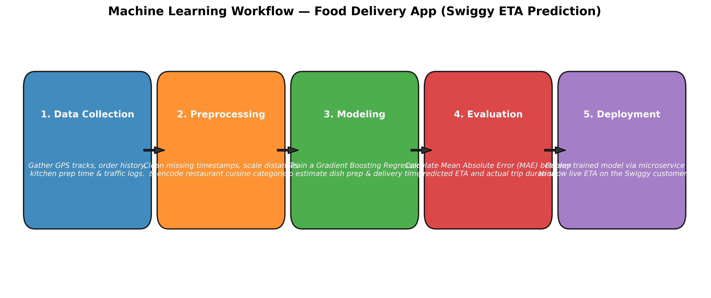

# Session 1 - Task 3: Basic Machine Learning Workflow (Swiggy Food Delivery Case Study)

## Task Overview
Draw a simple diagram (hand-drawn or digital) showing the basic ML workflow: **Data → Preprocessing → Modeling → Evaluation → Deployment**. Under each step, write a one-line example of what happens at that stage for a food delivery app like **Swiggy**.

---

## Workflow Diagram

```
+-------------------+      +-------------------+      +-------------------+      +-------------------+      +-------------------+
|  1. DATA          |      |  2. PREPROCESSING |      |  3. MODELING      |      |  4. EVALUATION    |      |  5. DEPLOYMENT    |
|  Collection       | ---> |  & Cleaning       | ---> |  & Training       | ---> |  & Testing        | ---> |  & Serving        |
+-------------------+      +-------------------+      +-------------------+      +-------------------+      +-------------------+
          |                          |                          |                          |                          |
          v                          v                          v                          v                          v
  GPS tracks, prep           Handle missing values,     Train XGBoost Regressor     Calculate MAE/RMSE         Expose REST API for
  times, & traffic logs      scale route distances      to predict food ETA        on test order logs         real-time live ETA
```



---

## Step-by-Step Swiggy Example

1. **Data Collection:**
   > *Swiggy collects raw telemetry data including restaurant kitchen prep times, customer delivery coordinates, delivery agent GPS speeds, historical traffic patterns, and weather status.*

2. **Preprocessing:**
   > *Swiggy imputes missing delivery timestamps, encodes categorical features (e.g., cuisine type, order vehicle type), and normalizes continuous values like route distance.*

3. **Modeling:**
   > *Swiggy trains a supervised regression algorithm (such as Gradient Boosting or Random Forest Regressor) to estimate dish preparation time and total delivery duration.*

4. **Evaluation:**
   > *Swiggy evaluates model precision on holdout test orders using metrics like Mean Absolute Error (MAE) to verify predictions are within acceptable error margins (e.g. ±3 minutes).*

5. **Deployment:**
   > *Swiggy containerizes the trained model and deploys it as a low-latency REST API microservice integrated into the customer app checkout flow to display live ETA.*
