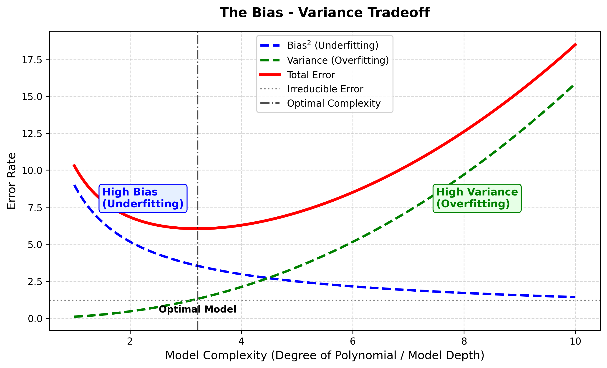

# Session 2 - Task 4: The Bias–Variance Tradeoff (Zomato Rating Predictor Application)

## Task Overview
Draw or find a graph online that visually explains the bias–variance tradeoff, and write a short note describing how this tradeoff would affect predictions in a **Zomato restaurant rating predictor app**.

---

## Visual Graph

---

## Application Note: Effect on Zomato Restaurant Rating Predictor App

### 1. High Bias (Underfitting)
* **What happens:** An oversimplified model (such as a simple linear model using only a single feature like `average_cost_for_two`) assumes a simplistic straight-line relationship.
* **Effect on Zomato:** The model fails to capture crucial rating factors such as cuisine style, location popularity, user reviews, and sanitation scores. It delivers **consistently poor rating predictions** across both high-end fine dining and local street food stalls.

### 2. High Variance (Overfitting)
* **What happens:** An overly complex model (such as an unconstrained Decision Tree with 50 features including specific reviewer usernames or transient holiday surges) memorizes training data noise.
* **Effect on Zomato:** The model achieves 100% accuracy on existing restaurants in the training set but **fails drastically when predicting ratings for newly listed restaurants**, giving wildly volatile and incorrect predictions.

### 3. Optimal Tradeoff (Balanced Generalization)
* **What happens:** A tuned model (e.g., Random Forest or Regularized Gradient Boosting) balances model complexity to minimize total prediction error ($\text{Total Error} = \text{Bias}^2 + \text{Variance} + \text{Irreducible Error}$).
* **Effect on Zomato:** Accurately generalizes to predict ratings of newly onboarded restaurants using key features (location, cuisine, cost range, delivery speed) with minimal real-world error.
