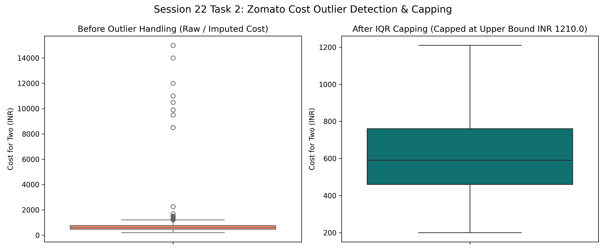

# Session 22 - Task 2: Missing Value Imputation & IQR Outlier Capping

## Task Overview
Identify missing values in `cost` and `rating` columns, perform **median imputation**, detect extreme outliers in `cost` using the **Interquartile Range (IQR)** method, and cap extreme values at the upper IQR threshold.

---

## 1. Missing Value Imputation

- **`cost` column**: 25 missing values $\rightarrow$ Imputed with median ($\text{INR } 590.00$)
- **`rating` column**: 20 missing values $\rightarrow$ Imputed with median ($3.60$)

---

## 2. IQR Outlier Analysis for `cost`

The Interquartile Range (IQR) was computed as follows:

$$\text{IQR} = Q_3 - Q1 = 760.00 - 460.00 = 300.00$$

$$\text{Upper Bound} = Q_3 + 1.5 \times \text{IQR} = 760.00 + 1.5 \times 300.00 = \mathbf{1210.00}$$

$$\text{Lower Bound} = Q_1 - 1.5 \times \text{IQR} = 460.00 - 1.5 \times 300.00 = 10.00$$

- **Outliers Identified**: **33 restaurants** exceeded the upper bound threshold of INR 1,210.00 (with maximum extreme cost of INR 15,000.00).
- **Outlier Capping**: All cost values exceeding INR 1,210.00 were capped at INR 1,210.00 using `np.clip()`.

---

## 3. Visual Comparison

