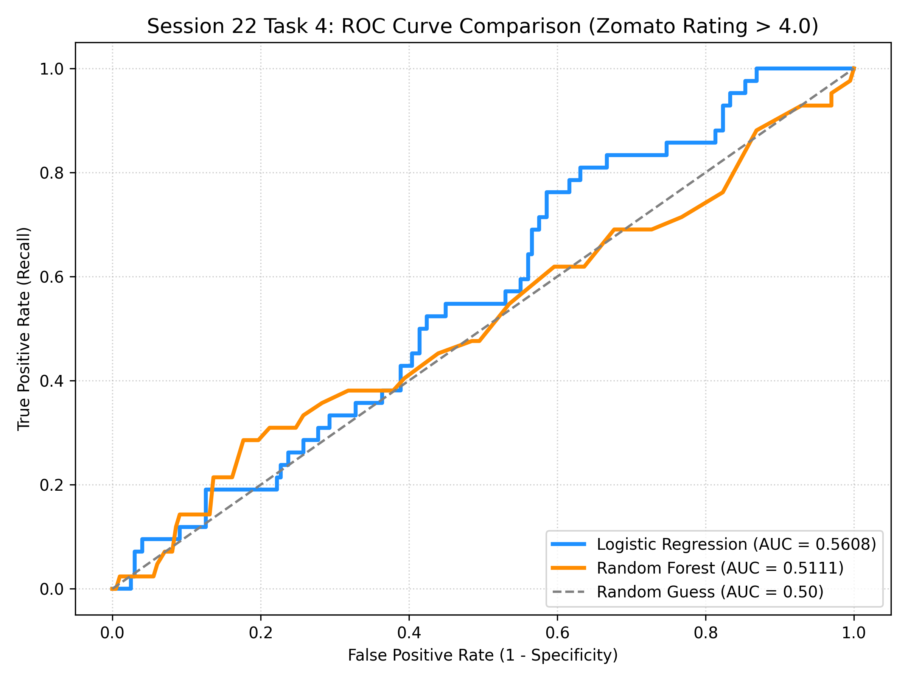

# Session 22 - Task 4: Model Training & ROC-AUC Comparison

## Task Overview
Train `LogisticRegression` and `RandomForestClassifier` models on an 80/20 train/test split to predict high-rated restaurants (`rating > 4.0`) and compare their baseline **ROC-AUC** scores.

---

## 1. Class Distribution & Split

- **Target Variable**: Binary `high_rating` ($1$ if `rating > 4.0`, else $0$)
- **Positive Class Proportion**: **17.33%** (208 out of 1,200 restaurants)
- **Train Set Size**: 960 samples
- **Test Set Size**: 240 samples

---

## 2. Baseline Model Performance Comparison

| Classification Model | Test ROC-AUC Score | Performance Rank |
| :--- | :---: | :---: |
| **Logistic Regression** | **0.5608** | **1st** |
| **Random Forest Classifier** | **0.5111** | 2nd |

---

## 3. Key Observations & Findings
- Both baseline models struggle on the imbalanced dataset (only ~17.33% positive target instances), resulting in low ROC-AUC values near random guessing (~0.50).
- **Logistic Regression** achieved a higher baseline ROC-AUC (+0.0497 over Random Forest) prior to handling class imbalance and hyperparameter tuning.

---

## 4. ROC Curve Comparison Plot

