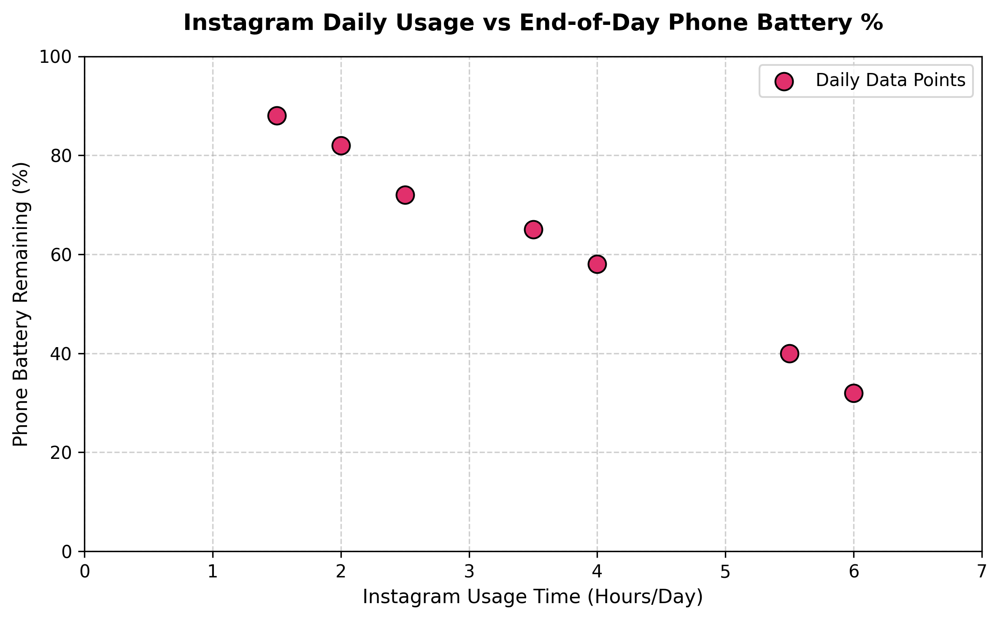

# Session 5 - Task 1: Data Generation & Scatter Plot (Instagram Hours vs Battery %)

## Task Overview
Create a Python script that generates two arrays: one representing the number of hours you spend on Instagram each day for a week, and the other representing your daily phone battery percentage at the end of the day. Plot these as a scatter plot using matplotlib.

---

## Weekly Telemetry Data Table

| Day of Week | Instagram Usage (Hours/Day) | End-of-Day Battery Percentage (%) |
|---|---|---|
| Monday | 1.5 hrs | 88% |
| Tuesday | 2.0 hrs | 82% |
| Wednesday | 3.5 hrs | 65% |
| Thursday | 4.0 hrs | 58% |
| Friday | 2.5 hrs | 72% |
| Saturday | 5.5 hrs | 40% |
| Sunday | 6.0 hrs | 32% |

---

## Generated Scatter Plot

