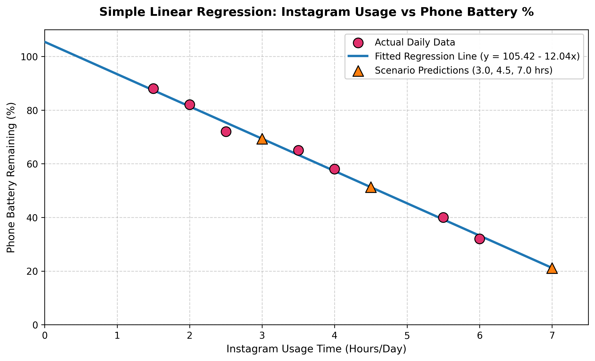

# Session 5 - Task 5: Best-Fit Regression Line Visualization

## Task Overview
Visualize the Simple Linear Regression best-fit line superimposed over the original weekly telemetry scatter data points, along with new test scenario predictions.

---

## Best-Fit Line Visualization

---

## Visual Summary & Key Findings
1. **Strong Negative Slope ($m = -12.04$):** The linear trendline clearly captures the inverse relationship between screen time on Instagram and remaining phone battery.
2. **Scatter Points Alignment:** The real weekly data points align very closely with the fitted regression line, visually demonstrating the high $R^2$ score of **0.9933**.
3. **Scenario Predictions:** Orange triangular markers highlight predictions for $3.0\text{ hrs}$, $4.5\text{ hrs}$, and $7.0\text{ hrs}$, demonstrating how the linear model generalizes for arbitrary user screen times.
