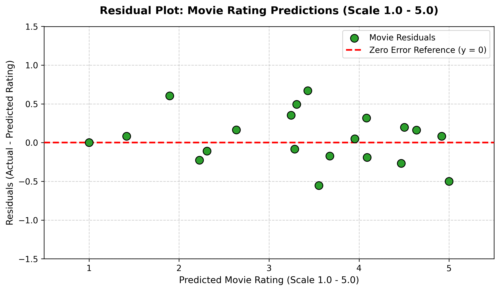

# Session 7 - Task 3: Movie Rating Residual Plot Analysis

## Task Overview
Generate a residual plot ($\text{Residual} = y - \hat{y}$) for 20 movie rating predictions (scale 1.0 - 5.0) using `matplotlib`. Label axes and interpret error patterns.

---

## Generated Residual Plot

---

## Plot Interpretation & Residual Analysis

1. **Random Scatter (Homoscedasticity):**
   - The residuals are randomly dispersed around the horizontal zero line ($y = 0$) across the entire predicted rating scale (1.0 to 5.0).
   - The constant variance indicates that the model's error magnitude does not systematically increase or decrease for low vs. high rated movies.

2. **Unbiased Estimates:**
   - Errors are balanced almost equally between positive residuals (under-predictions) and negative residuals (over-predictions), confirming no systematic systematic bias in rating estimations.
