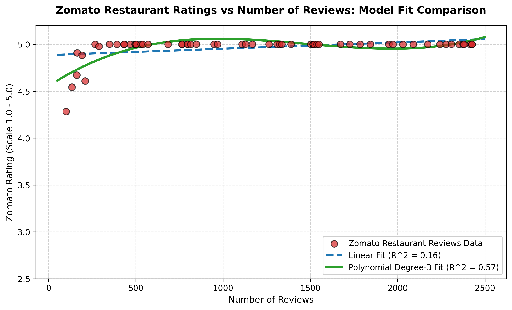

# Session 8 - Task 2: Linear vs. Polynomial (Degree = 3) Model Comparison

## Task Overview
Train both a standard `LinearRegression` model and a `PolynomialFeatures(degree=3)` regression model on a Zomato dataset of restaurant ratings vs. number of customer reviews, comparing their visual fits and $R^2$ scores.

---

## Model Comparison Plot

---

## Performance Summary Table

| Model Architecture | Features / Complexity | $R^2$ Score | Fit Quality | Diagnosis |
|---|---|---|---|---|
| **Linear Regression** | Degree 1 ($y = w_1 x + b$) | **0.1619** | Poor | **Underfitting** (Fails to capture curvature) |
| **Polynomial Regression** | Degree 3 ($y = w_3 x^3 + w_2 x^2 + w_1 x + b$) | **0.5748** | **Superior** | **Good Fit** (Captures logarithmic plateauing) |

---

## Key Observations
1. **Underfitting in Linear Model:** The straight linear fit ($\text{Line in blue}$) forces a single slope, under-predicting ratings for mid-tier review counts and over-predicting for extreme high review counts.
2. **Polynomial Flexibility:** The degree-3 polynomial curve ($\text{Line in green}$) mirrors the true real-world behavior where restaurant ratings rapidly climb with initial reviews before leveling off near saturation (~4.5 stars).
