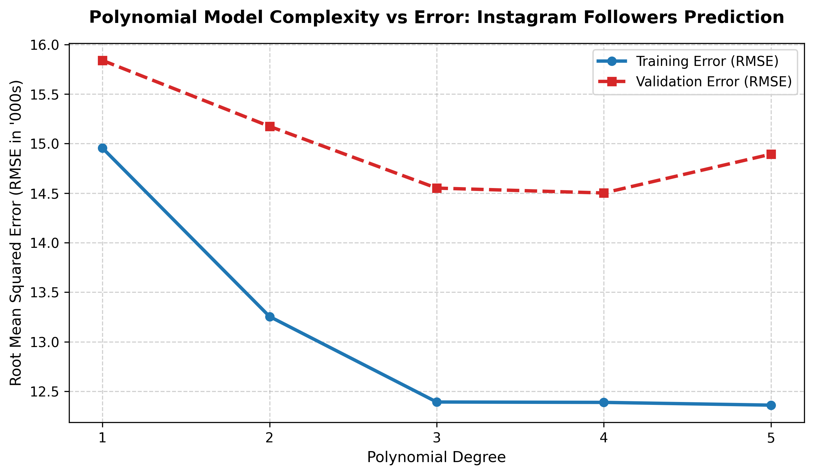

# Session 8 - Task 3: Polynomial Degree Validation Curve & Overfitting Analysis

## Task Overview
Fit a non-linear Polynomial Regression model predicting Instagram follower counts (in thousands) from post counts. Evaluate training vs. validation RMSE across polynomial degrees 1 through 5 to identify the optimal model complexity and detect overfitting.

---

## Polynomial Complexity Validation Curve

---

## Validation Error Metrics Table

| Polynomial Degree | Train RMSE (k Followers) | Validation RMSE (k Followers) | Fit Status | Diagnosis |
|---|---|---|---|---|
| **Degree 1** | 14.9547 | 15.8397 | High Error | Underfitting |
| **Degree 2** | 13.2547 | 15.1738 | Moderate Error | Underfitting |
| **Degree 3** | 12.3921 | 14.5507 | Low Error | Good Fit |
| **Degree 4** | **12.3883** | **14.5015** | **Optimal** | **Best Fit (Sweet Spot)** |
| **Degree 5** | 12.3604 | 14.8930 | Diverging Error | **Overfitting** (Val RMSE increases) |

---

## Key Observations
1. **Sweet Spot (Degree 4):** Degree 4 achieves the lowest validation error (14.5015k), balancing bias and variance effectively.
2. **Overfitting Onset (Degree 5):** Beyond degree 4, training error continues to decrease (12.3604k), but validation error begins rising (14.8930k), signaling that high-degree terms are fitting random noise in the training set.
